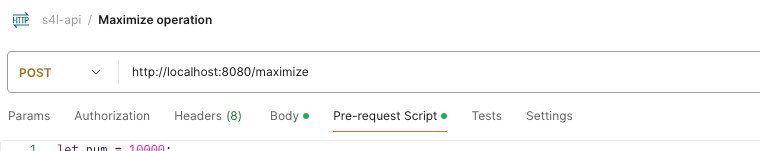
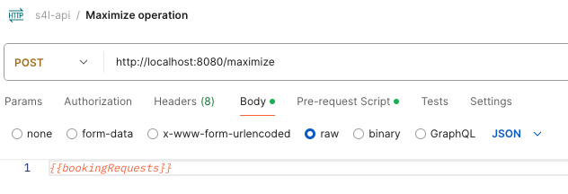
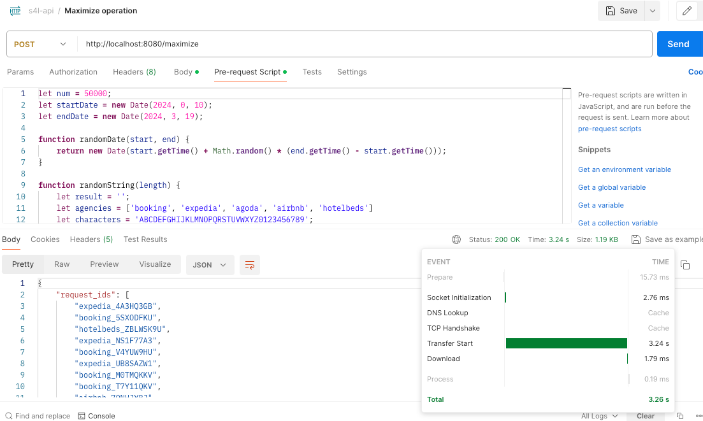

# sfl-challenge

Stayforlong code challenge.

Author: Marcos Rial Troncoso \
Date: 20-may-2024

## Requirements

- Java 17
- Maven 3+
- Docker

If you only want to run the service, with Docker is enough.

## Description and details

For the challenge we used a two layer architecture, with a *presentation* layer for APIs implementations, and a *domain* layer that contains the business logic.

#### Presentation layer

There is 3 main files here:
- `BookingMapper`: The mapper from DTOs to Domain Objects and vice-versa.
  - Implemented using the library *MapStruct*
- `CommonControllerAdvice`: Component for global exception management in Rest controllers.
- `BookingRestController`: Rest controller that implements the 2 API functions of the specification
  - We used the plugin `openapi-generator-maven-plugin` to generate the interface from the api specification, located in `src/main/resources/api_definition.yml`
  - This class implements the generated interfaces `StatsApi` and `MaximizeApi`

#### Domain layer

Domain focused on bookings operations:

- Domain objects:
  - `Booking` & `BookingStats`
- Domain facade:
  - `BookingService` with his default implementation
- Bookings strategy selector
  - `BookingSelector` is the strategy pattern interface
  - We recreated two implementations:
    - `BookingProfitOptimizer`: Implementation that searchs for the best bookings combination with the best profit (detailed with comments in the file)
    - `RandomSelector`: Simple complementary selector

#### Additional packages

- `utils` package for commons functionality
- `configurations` package containing configuration components that could affect the service behaviour
  - I.e. the defined within `BookingsConfiguration` to use a specific booking selector strategy 


## Execution

There is two alternatives to launch the service:
- **Compiling and executing with *maven*** from path `s4l-challenge`. \
    With the next command we can compile and verify the build:
    ```
    mvn clean verify
    ```
    And then can be executed with:
    ```
    mvn spring-boot:run
    ```
- **Run the *docker-compose*** file from path `docker` \
    Build image and create container with the command:
    ```
    docker-compose up -d
    ```

### Execution extras
- We can modify some docker properties defined in the `.env` file
  - `HOST_PORT` will set the user machine port where the service will be available

#### Default API paths

- [POST] http://localhost:8080/stats
- [POST] http://localhost:8080/maximize

### Local results

Using Postman we have defined a script to generate random bookings:

```
let num = 10000;
let startDate = new Date(2024, 0, 10);
let endDate = new Date(2024, 0, 19);

function randomDate(start, end) {
    return new Date(start.getTime() + Math.random() * (end.getTime() - start.getTime()));
}

function randomString(length) {
    let result = '';
    let agencies = ['booking', 'expedia', 'agoda', 'airbnb', 'hotelbeds']
    let characters = 'ABCDEFGHIJKLMNOPQRSTUVWXYZ0123456789';
    for (let i = 0; i < length; i++) {
        result += characters.charAt(Math.floor(Math.random() * characters.length));
    }
    return `${agencies[Math.floor(Math.random() * agencies.length)]}_${result}`;
}

let bookingRequests = [];
for (let i = 0; i < num; i++) {
    let checkInDate = randomDate(startDate, endDate);
    let reservation = {
        "request_id": randomString(8),
        "check_in": checkInDate.toISOString().split('T')[0],
        "nights": Math.floor(Math.random() * 9) + 1, // 1 to 10 nights
        "selling_rate": Math.floor(Math.random() * 9) * 100 + 100, // $100 to $1100
        "margin": Math.floor(Math.random() * 3) * 5 + 5 // 5% to 20%
    };
    bookingRequests.push(reservation);
}

// Set the generated data as an environment variable
pm.environment.set("bookingRequests", JSON.stringify(bookingRequests));
```

This can be added to the **Pre-request script** and then use the list in the body:




**Results:**

| Request number | Time    |
|----------------|---------|
| 10000          | 186 ms  |
| 20000          | 592 ms  |
| 30000          | 1188 ms |
| 50000          | 3.24 s  |



